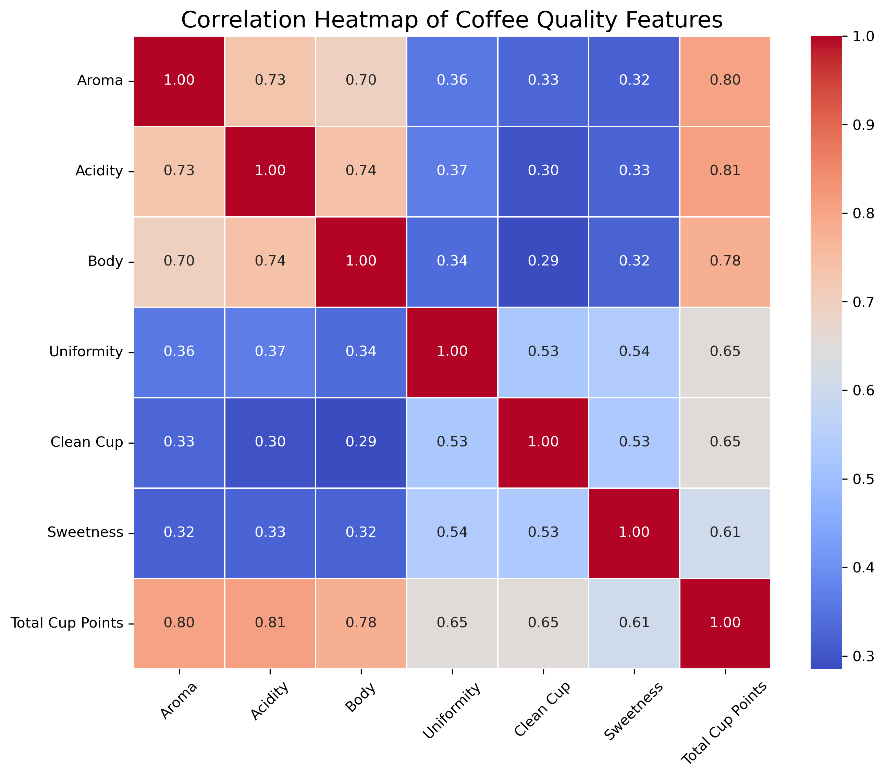
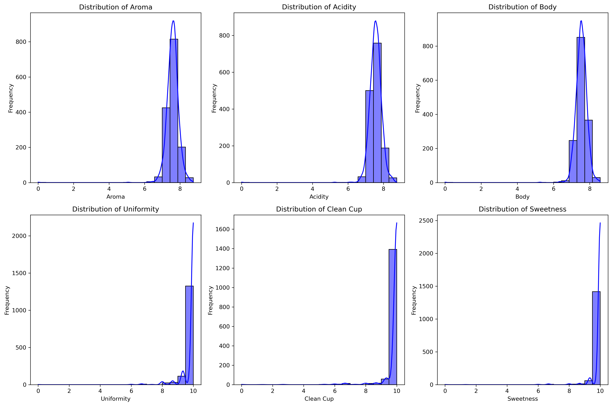

# kawaScore_linear_regression_model

## Table of Contents

1. [Mission](#mission)
2. [Dataset](#dataset)
   - [Source](#source)
   - [Description](#description)
3. [Visualizations](#visualizations)
   - [Correlation Heatmap](#1-correlation-heatmap)
   - [Feature Distributions](#2-feature-distributions-histograms)
4. [Swagger UI Documentation](#swagger-ui-documentation)
5. [YouTube Video Demo](#youtube-video-demo)
6. [Running the Mobile App](#running-the-mobile-app)
   - [Prerequisites](#prerequisites)
   - [Steps](#steps)
7. [Technologies Used](#technologies-used)
8. [Contact](#contact)

---

## Mission

The goal of this project is to predict the **Total Cup Points** of coffee samples based on their sensory attributes such as Aroma, Acidity, Body, Uniformity, Clean Cup, and Sweetness. This prediction tool is designed to assist cooperatives in evaluating the quality of coffee beans supplied by farmers, enabling them to make informed purchasing decisions. By leveraging data-driven insights, cooperatives can ensure fair pricing, improve supply chain transparency, and promote high-quality coffee production.

---

## Dataset

### Source

The dataset used in this project is sourced from **Kaggle**: [Coffee Quality Institute Arabica Reviews May 2023](https://www.kaggle.com/datasets/erwinhmtang/coffee-quality-institute-reviews-may2023?select=arabica_coffee_cupping_scores.csv).

### Description

The Coffee Quality Institute (CQI) is a non-profit organization dedicated to improving the quality and value of coffee worldwide. Founded in 1996, CQI works with coffee growers, processors, roasters, and other stakeholders to promote coffee quality standards, sustainability, and the development of the specialty coffee industry.

The dataset contained many columns.However, in my linear regression model, these columns are the ones selected to train our model based on their correlation with the target variable (`Total Cup Points`):

- **Aroma**: The fragrance of the coffee.
- **Acidity**: The brightness and sharpness of the coffee.
- **Body**: The weight and texture of the coffee.
- **Uniformity**: Consistency of the coffee across cups.
- **Clean Cup**: Absence of defects in the coffee.
- **Sweetness**: The natural sweetness of the coffee.
- **Total Cup Points**: The overall quality score of the coffee (target variable).

---

## Visualizations

### 1. Correlation Heatmap

The correlation heatmap shows the relationships between the features and the target variable (`Total Cup Points`). Features with high correlation (e.g., Aroma, Acidity) are more influential in predicting coffee quality.



### 2. Feature Distributions (Histograms)

The histograms below show the distribution of key features like Aroma, Acidity, and Body. These distributions help us understand the range and variability of the data, which is crucial for model training.



---

## API Endpoint for prediction

🔗 **API Endpoint for prediction**: [https://kawascore-linear-regression-model.onrender.com/predict](https://kawascore-linear-regression-model.onrender.com/docs)

### Example Request

```json
{
  "aroma": 7.5,
  "acidity": 8.0,
  "body": 7.0,
  "uniformity": 9.0,
  "Clean Cup": 10.0,
  "sweetness": 8.5
}
```

## Swagger UI Documentation

The trained Linear Regression model is deployed as a REST API using FastAPI. You can access the API documentation and test it using the following link:

🔗 **API Documentation**: [https://kawascore-linear-regression-model.onrender.com/docs](https://kawascore-linear-regression-model.onrender.com/docs)

## YouTube Video Demo

Watch a 5-minute demo of the mobile app and API in action:

## 🎥 **YouTube Video**: [https://youtu.be/uirnm2eWdVA](https://youtu.be/uirnm2eWdVA)

## Running the Mobile App

Follow these steps to run the mobile app on your local machine:

### Prerequisites

1. **Flutter SDK**: Ensure you have Flutter installed. If not, download it from [https://flutter.dev](https://flutter.dev).
2. **Android Studio or Xcode**: For running the app on an emulator or physical device.

### Steps

1. Clone the repository:

   ```bash
   git clone https://github.com/pimanzi/https://github.com/pimanzi/kawaScore_linear_regression_model.git
   ```

2. Navigate to flutterapp directory

```bash
 cd summative/flutterapp
```

3. Install depedencies

   ```bash
   flutter pub get
   ```

4. Run the app

   ```
   flutter run
   ```

## Technologies Used

- **Frontend**: Flutter (Mobile App)
- **Backend**: FastAPI (Python)
- **Machine Learning**: Scikit-learn (Linear Regression), pandas , seaborn, matplotlib, numpy
- **Deployment**: Render (API Hosting)

---

## Contact

For questions or feedback, feel free to reach out:

- **Email**: imanzikabisa@gmail.com
- **GitHub**: [Github-Username](https://github.com/pimanzi)
